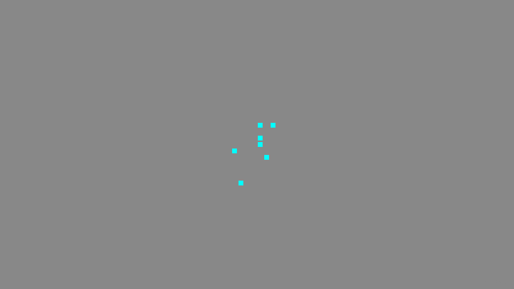

# CLAUDE.md

This file provides guidance to Claude Code (claude.ai/code) when working with code in this repository.

## Project

**pwarf** is a browser-based Dwarf Fortress clone: a colony sim with autonomous dwarves in a procedurally generated world. Stack: TypeScript + PixiJS (rendering) + React (UI overlay) + bitecs (ECS) + Vite.

## Commands

```bash
npm run dev          # Start Vite dev server
npm run build        # Typecheck + Vite production build
npm run lint         # ESLint (TypeScript files in src/, tests/, scripts/)
npm run typecheck    # tsc --noEmit only
npm test             # Run all tests once (Vitest, Node environment)
npm run test:watch   # Vitest in watch mode
npm run test:ui      # Vitest browser UI
```

Run a single test file:
```bash
npx vitest run tests/core/HeadlessGame.test.ts
```

CI runs: lint → typecheck → test → build (in that order).

## Architecture

### ECS (bitecs v0.4)

The game uses [bitecs](https://github.com/NateTheGreatt/bitecs) v0.4 — **API differs from v0.3**:
- Components are plain typed arrays (no `defineComponent()`), sized to `MAX_ENTITIES` (10 000)
- `addComponent(world, eid, component)` — eid comes **before** component
- `query(world, [Component])` — called directly each tick, no `defineQuery()`
- `observe(world, onAdd(Comp), cb)` replaces `enterQuery` / `exitQuery`

Non-numeric per-entity data (strings, arrays) lives in side stores (`src/core/stores.ts`) keyed by entity ID.

### Path aliases (tsconfig + vite-tsconfig-paths)

| Alias | Maps to |
|---|---|
| `@core/*` | `src/core/*` |
| `@map/*` | `src/map/*` |
| `@entities/*` | `src/entities/*` |
| `@systems/*` | `src/systems/*` |
| `@ui/*` | `src/ui/*` |
| `@data/*` | `src/data/*` |

### `HeadlessGame` (src/core/HeadlessGame.ts)

The primary simulation interface — no DOM/browser dependencies. Used by tests and future CI headless runs.

Lifecycle: `new HeadlessGame({ seed, width?, height?, depth? })` → `embark()` → `tick()` / `runFor(n)`.

- `embark()` creates the ECS world, generates a flat stone floor at z=0, spawns 7 dwarves at map center
- `tick()` / `runFor(n)` advance the sim and return a `GameState` snapshot (`{ tick, dwarves, stocks }`)
- Systems will be registered inside `tick()` as they are built; currently only the tick counter advances

### World constants (src/core/constants.ts)

```
WORLD_WIDTH/HEIGHT = 128, WORLD_DEPTH = 16 (0 = surface, negative = underground)
TILE_SIZE = 16px, TICKS_PER_SECOND = 20, MAX_ENTITIES = 10 000
```

### Planned modules (aliases pre-configured, directories not yet created)

- `@map` — 3D tile world (`World3D`) and tile types
- `@systems` — pure `SystemFn = (world, dt) => void` functions called each tick
- `@entities` — entity factory helpers
- `@ui` — React overlay components
- `@data` — static game data (YAML via js-yaml)

## TypeScript strictness

`strict: true`, `noUncheckedIndexedAccess: true`, `exactOptionalPropertyTypes: true`. Array/typed-array index access returns `T | undefined` — always check before use.

## Branch policy

One branch per issue (see CI/agent guide in `.github/`). PRs target `main`.

**Every code change must have a GitHub issue.** Before starting any implementation work, check that a GitHub issue exists and reference it in the branch name (`feat/issue-NNN-short-description`) and PR title (`closes #NNN`). Do not open a PR without a linked issue.

**PRs must have exactly one commit before merging.** Squash all work-in-progress commits before opening or updating a PR: `git rebase -i origin/main` and squash everything into a single commit with a clean message.

**Delete the branch after a PR is merged.** Remote branches should be deleted via the GitHub PR UI ("Delete branch") or `git push origin --delete <branch>`. Also prune the local ref: `git fetch --prune`.

After rebasing a branch onto main, force-push is expected and safe: `git push --force-with-lease`.

## Screenshots for visual PRs

Any PR that touches `src/ui/` **must** include screenshots. Follow these steps:

**Before making changes** — take a baseline screenshot on the current branch:
```bash
npm run screenshot          # saves screenshots/latest.png
mv screenshots/latest.png screenshots/before.png
```

**After making changes** — take an after screenshot:
```bash
npm run screenshot          # saves screenshots/latest.png (the "after")
```

Commit both `screenshots/before.png` and `screenshots/latest.png` to the branch, then embed them in the PR body:

```markdown
## Screenshots
| Before | After |
|--------|-------|
|  |  |
```

If there is no meaningful "before" (e.g. adding a brand-new UI feature), only include the "after" screenshot.

## Agent model selection

- **Subagents** (research, search, exploration, file reads): use `model: "sonnet"`
- **Trivial lookups** (single file search, simple one-off questions): use `model: "haiku"`
- **Main context** (synthesis, architectural decisions, writing code): opus (default — no override needed)

Never spawn a subagent with opus. Reserve the main context for work that requires synthesis across multiple sources or non-trivial code generation.
